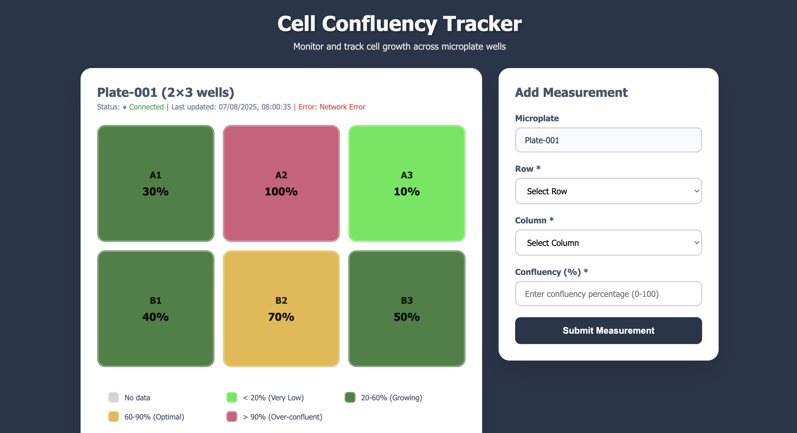
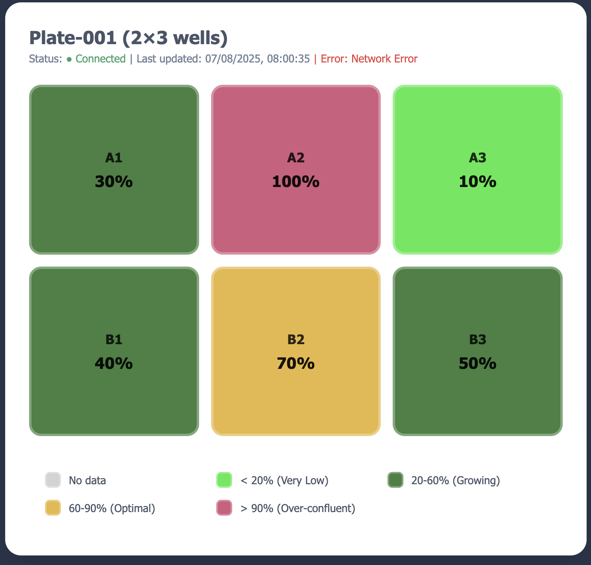
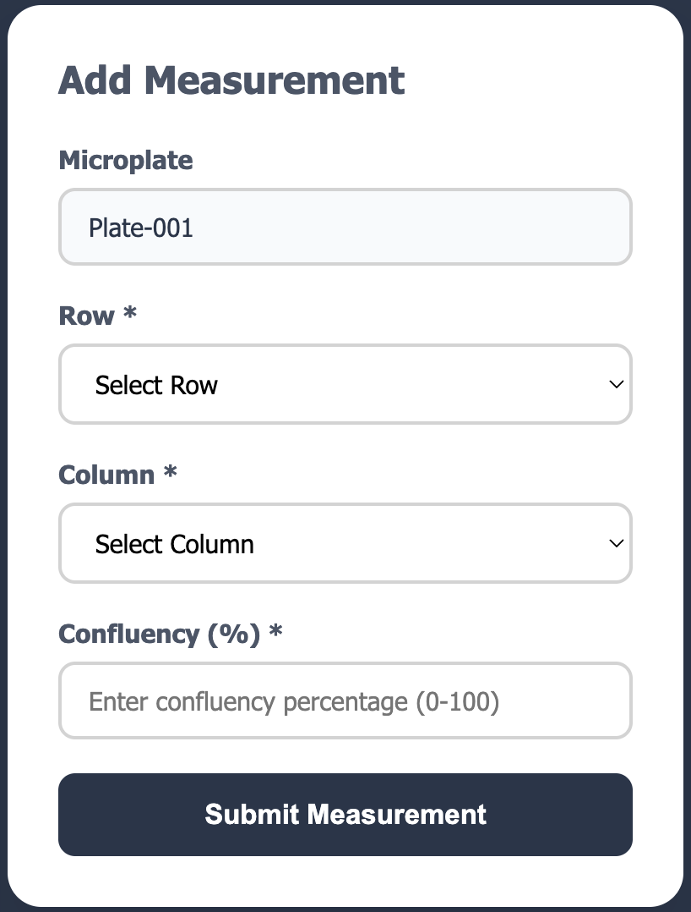

# Cell Culture Confluency Tracker

## Overview



This is a full-stack application created to help scientists track and visualize cell confluency on microplates, giving them a simple way to log new measurements.

## Tech Stack

**Backend:** Flask + SQLAlchemy + SQLite  
**Frontend:** React + Axios  
**Database:** SQLite (development), configurable for MySQL/PostgreSQL

## Quick Setup

### Backend Setup
```bash
# Access backend folder
cd flask-backend

# Use Python venv (optional)
source venv/bin/activate

# Install requirements
pip3 install -r requirements.txt

# Run Flask server
python flask_backend.py
```

Server runs on `http://localhost:5000`

### Frontend Setup
```bash
# Access frontend folder
cd cell-confluency-tracker

# Install dependencies
npm install axios

# Start development server
npm start
```

Frontend runs on `http://localhost:3000`

## Running the application

1. Start the backend: `python flask_backend.py`
2. Start the frontend: `npm start`
3. Open browser to view the application at `http://localhost:3000`

## API Design & Data Models

### Database Schema
```sql
-- Microplates table
microplates: id, name, rows, columns, created_at
---- rows, columns: number of rows and columns for microplates, to scale for different types of microplates
           
-- Measurements table  
measurements: id, microplate_id, row, column, confluency_percentage, timestamp
```

### API Endpoints
- `GET /api/microplates` - List all microplates
- `GET /api/microplates/{id}/measurements/latest` - Get latest measurement per well
- `POST /api/microplates/{id}/measurements` - Submit new measurement
- `GET /api/health` - Health check

### Well Grid Structure
- **Coordinates**: 0-based indexing (row 0 = A, column 0 = 1)
- **Display**: Dynamic grid adapts to microplate dimensions
- **Color Coding**: Visual representation of confluency ranges:
  - Grey: No data
  - Light Green: < 20% (Very Low)
  - Green: 20-60% (Growing)
  - Yellow: 60-90% (Optimal)
  - Pink: > 90% (Over-confluent)

### Data Flow
1. **Frontend → Backend**: Form submissions via POST requests
2. **Backend → Database**: SQLAlchemy for data persistence
3. **Database → Frontend**: Real-time updates every 5 seconds

## Assumptions & Limitations

**Assumptions:**
- Single microplate focus, but easily extendable to multiple plates.
- Manual confluency input
- 6-well plate default, but configurable

**Known Limitations:**
- Limited to SQLite for development.
- No ability to create and manage multiple plates.

## UI Screenshots

### Microplate View

### Measurement Form
